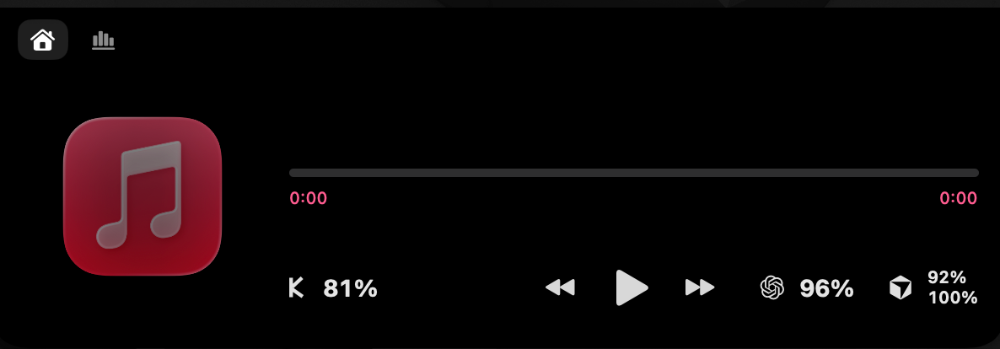
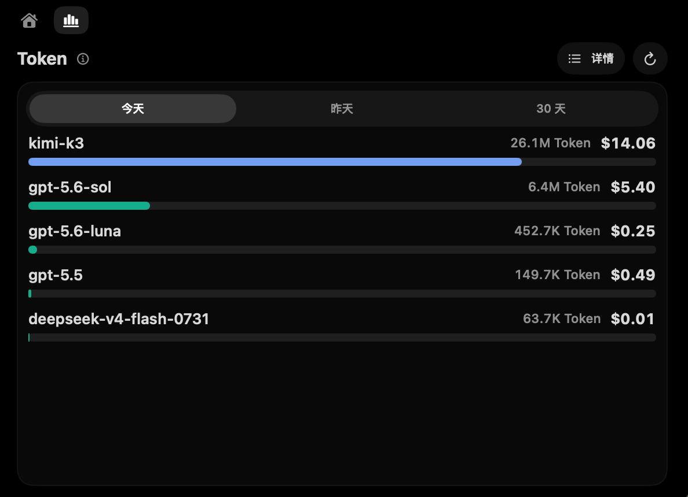
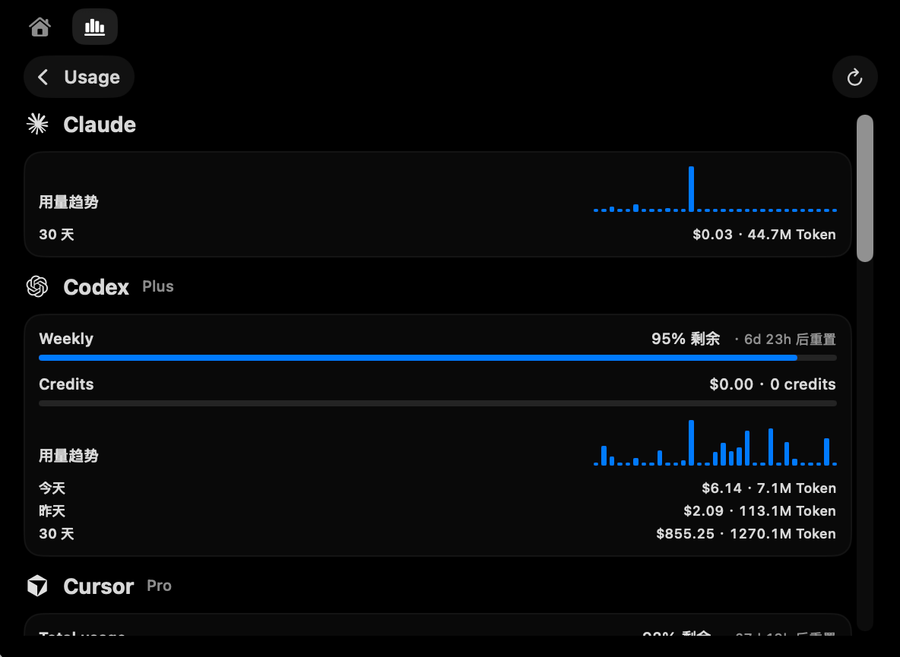

<p align="center">
  
</p>

<p align="center">
  
  
</p>

# MM

MM 是一个 macOS 菜单栏应用，主要提供**音乐控制 + AI 用量面板**，集成 Claude、Codex、Cursor、Antigravity、Copilot、Devin、Grok、Kimi、OpenCode、OpenRouter、Z.ai。

## 主要功能

### 音乐播放控制

- 刘海区域的播放/暂停/切歌控制，支持 Apple Music / Spotify / Now Playing / YouTube Music
- 展开面板显示专辑封面与播放进度，点击刘海外部即可关闭

### AI 用量面板

- 在刘海展开面板中直接查看各 AI 提供商的用量与费用：Claude / Codex / Cursor / Z.ai / OpenRouter / Kimi / Pi 等
- **Kimi**：查询 Kimi For Coding 订阅的 5 小时窗口与周限额用量
- **Pi**：聚合本机 pi 会话日志（`~/.pi/agent/sessions`）的 token 与费用
- 刘海关闭状态下显示 provider 用量图标条：Kimi 在播放按钮左侧，Codex/Cursor 在右侧，点图标直达对应详情页
- 30 天模型用量视图：窗口高度钳制在屏幕内，模型过多时列表可滚动
- 设置 → 用量：开关各 Provider、填写/替换 API Key、配置后台刷新间隔（最短 30 秒）


## 系统要求

- macOS **14 Sonoma** 或更高
- Apple Silicon 或 Intel

## 安装

1. 从 [Releases](https://github.com/shuo1104/mac_menu/releases/latest) 下载 `MM.dmg`
2. 打开 DMG，把 **MM.app** 拖到 **Applications**
3. 首次打开：若提示无法验证开发者，**右键 App → 打开 → 仍要打开**

> 本仓库发布的构建使用 **ad-hoc 签名**（无 Apple Developer 证书），Gatekeeper 警告是预期行为。

## 从源码构建

```bash
xcodebuild \
  -project MM.xcodeproj \
  -scheme MM \
  -configuration Release \
  -destination 'generic/platform=macOS' \
  -derivedDataPath build/DerivedData \
  CODE_SIGN_IDENTITY="-" \
  build
```

产物：`build/DerivedData/Build/Products/Release/MM.app`

打包 DMG：

```bash
STAGE=build/dmg-stage
rm -rf "$STAGE" && mkdir -p "$STAGE" dist
ditto build/DerivedData/Build/Products/Release/MM.app "$STAGE/MM.app"
ln -s /Applications "$STAGE/Applications"
hdiutil create -volname "MM" -srcfolder "$STAGE" -ov -format UDZO dist/MM.dmg
```
## 安全说明

App **不启用 App Sandbox**，以便读取本机 AI CLI 凭证与用量日志（如 `~/.claude`、`~/.codex`、Cursor 等）。凭证仍保存在原始文件或 Keychain，应用不会另存副本。可在 **设置 → 用量** 关闭不需要的 Provider。

## 第三方组件

- [OpenUsage](https://github.com/robinebers/OpenUsage)
- [farion1231/cc-switch](https://github.com/farion1231/cc-switch)
- [MacroVisionKit](https://github.com/TheBoredTeam/MacroVisionKit)

## License

MM 基于 GPL-3.0 授权的软件修改而来，并继续以 **GNU GPL-3.0** 发布。详见 [LICENSE](LICENSE) 和 [NOTICE.md](NOTICE.md)。
